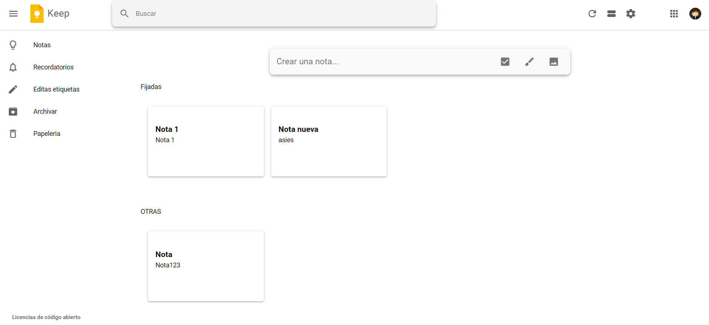
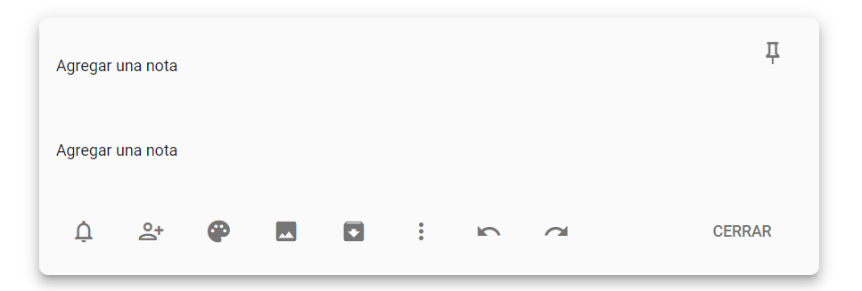
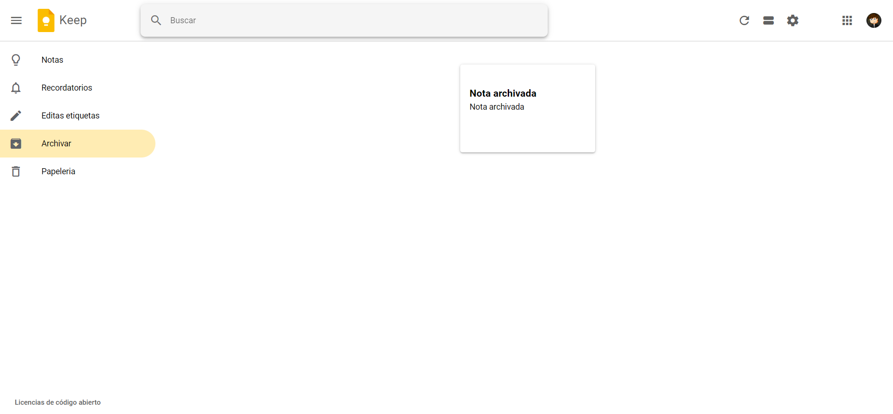
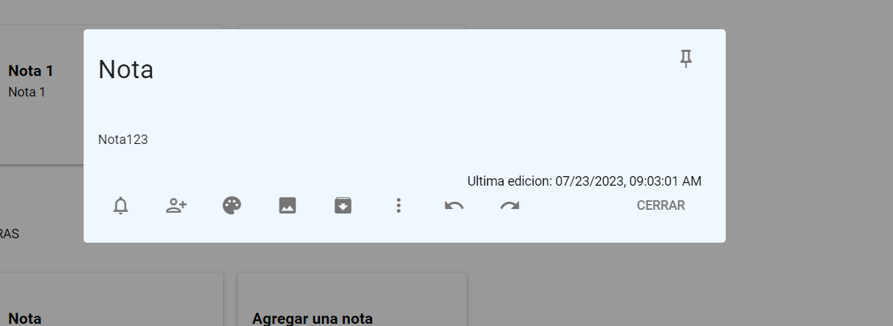
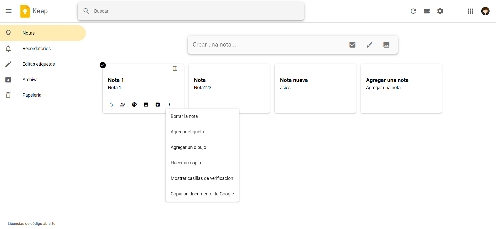

# Ejecutar la parte visual del proyecto
## Contenido
- [Instalación y Ejecución](#instalación-y-ejecución)
- [Descripción](#descripción)

# Instalación y Ejecución 
Antes de empezar asegúrese de tener Node >=14 y NPM >=6.14.12 o Yarn >= 1.21.1 instalados en su máquina. 
1.  Ingrese en a la carpeta notesAppFrontEnd y abra el simbolo del sistema y ejecute los siguientes comandos
```
  #Instalar Dependencias con Yarn:
  $ yarn install
```
2. Una vez instalado corra el servidor de desarrollo de Quasar
````
  #Iniciar  el servidor de Desarrollo
  $ yarn dev
````
En la ventana del simbolo del sistema te aparesera informacion y los links en donde se encuentra el proyecto

# Descripción
## Expliacion del funcionamiento de la aplicacion

### Pagina principal se replico el diseño la aplicaion de keep.



### Agregar una nota nueva 
Al precionar el input que dice Crear una nota ... ,aparecera el siguiente inpput
El boton a la derecha superior al presionarla cuando se agregue la nota 
El tercer boton de izquierda a derecha archiva las notas lo cual al guardarlo se va directamente a la parte de archivado



### Notas archivadas 
Nota archivada al navegar por el panel izauierdo y ir a la funcionalidad de archivar mostrara todas las notas archivadas



### Editar una nota
Se puede editar una nota sin importar si esta fijada o archivada.
Al hacer click a la nota se desplegara una ventana emergente la cual tendra la informacion de la nota a la cual se desea editar
Se podra fijar, archivar la nota tambien en esta ventana



### Eliminar una nora
Para elemimar una nota se pone el raton encima de la nota y apareceran los botones de la nota a la cual estas pasando el mouse
precionas el primer boton de derecha a izquierda el cual despliega un menu y Precionas Borrar la nota.
Asi se elimina la nota de la base de datos.




